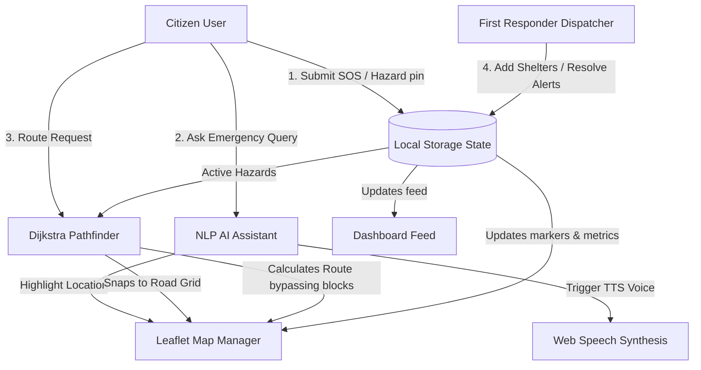

# LifeBridge AI — Emergency Response & Disaster Assistant

### 🏆 Track: Agents for Good
During disasters like floods, cyclones, earthquakes, and road accidents, information gaps can be fatal. Citizens struggle to find open shelters, discover safe routes, request emergency aid, locate missing loved ones, or perform basic first aid. First responders face hurdles triaging incoming reports.

**LifeBridge AI** bridges this gap. It is a premium, dark-mode, glassmorphic emergency response dashboard that integrates interactive mapping, intelligent routing, simulated AI assistance, crowd-sourced reporting, and offline-resilient features.

---

## 🗺️ System Workflow Architecture

This diagram illustrates how data flows between citizens, the client-side database, the Leaflet map layer, the Dijkstra pathfinder, and the First Responder Dispatch:



---

## ⚡ Core Features

### 1. Interactive Emergency Map
* Powered by Leaflet.js and CartoDB Dark Voyager tiles for high contrast.
* Features custom SVG markers for **Relief Camps (Cyan)**, **Operational Hospitals (Green)**, **Active Hazards (Orange/Red)**, and **Volunteer Hubs (Purple)**.
* Popups show live capacities, ICU bed vacancies, oxygen cylinder reserves, and roadblock severity details.

### 2. Roadblock-Aware Safe Route Planner
* Snaps clicks to a localized road network graph (Bangalore landmarks: Cubbon Park, MG Road, Trinity Circle, Brigade Road, Richmond Town).
* Implements a **Dijkstra pathfinding algorithm** that dynamically checks active roadblocks within a 300m range.
* If a street segment is blocked by flooding, the cost rises to infinity, forcing the pathfinder to calculate the next shortest *safe path*, drawing it in neon green on the map with step-by-step street instructions.

### 3. NLP Emergency Assistant (AI Agent)
* Simulated AI chatbot with natural language processing to answer safety queries instantly.
* Clickable links within replies trigger dashboard events (e.g., clicking *"Show Hospital Location"* shifts tabs and centers the map).
* **Text-to-Speech (TTS)**: Web Speech Synthesis API integration reads instructions aloud.
* Suggestion chips enable rapid one-click queries.

### 4. Interactive Preparedness Supply Checklist
* Multi-category checklists for Floods, Earthquakes, Cyclones, and Road Accidents.
* Interactive lists featuring dynamic percentage progress meters.
* Persisted to `localStorage` to survive page reloads.

### 5. Missing Persons Bulletin Board
* Crowd-sourced missing report registry (Name, Age, Gender, Last Seen, features, contact).
* Search indexing for quick name/location lookups.
* Interactive toggles to mark individuals "Located Safe", updating the public board in real-time.

### 6. First Responder Dispatch Portal
* Real-time grid displaying incoming citizen SOS alerts and road blockages.
* Responders can mark hazards "Resolved/Clear" which immediately removes roadblocks from the pathfinder and updates map pins.
* Admin form to register and place new shelters.

### 7. Dual-Tone SOS Distress Siren
* Synthesizes a loud wailing police/ambulance siren in-browser using Web Audio API oscillator nodes.
* Pulls precise coordinates via Web Geolocation.
* Pre-structures a broadcast text message for rescue coordination.

---

## 🛠️ Technology Stack
* **Frontend**: HTML5, Vanilla JavaScript (ES6 Modules), CSS Custom Properties (Variable design system).
* **Mapping**: Leaflet.js + Open CartoDB Tiles.
* **Audio Synthesis**: Web Audio API (Dual-tone frequency modulation).
* **Speech Synthesis**: Web Speech API (`SpeechSynthesisUtterance`).
* **Bundler & Server**: Vite.

---

## 🚀 Running Locally

1. **Clone the repository**:
   ```bash
   git clone <your-repository-url>
   cd lifebridge-ai
   ```
2. **Install dependencies**:
   ```bash
   npm install
   ```
3. **Start the development server**:
   ```bash
   npm run dev
   ```
4. **Build production bundle**:
   ```bash
   npm run build
   ```
