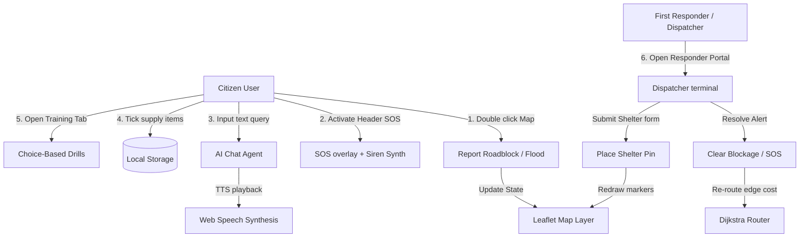
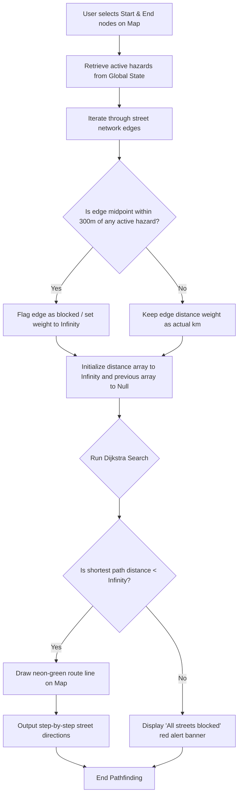
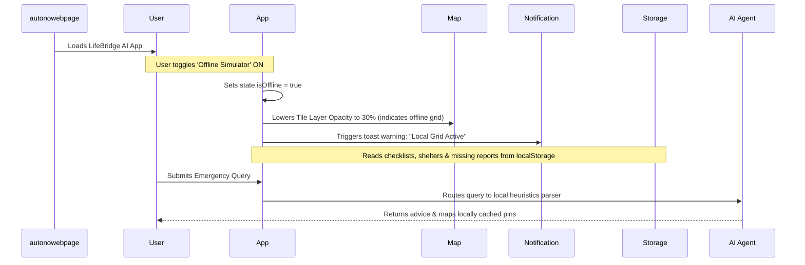

# LifeBridge AI — Project Architecture & Flows

LifeBridge AI is an interactive, browser-based emergency command dashboard and disaster assistant. Localized for **Bangalore, India**, it provides real-time mapping, offline-resilient utilities, AI-driven guidance, and volunteer coordination for citizens and first responders during crises like floods, cyclones, and road accidents.

---

## 🛠️ System Modules & Features

1. **Live Emergency Metrics**: Displays active open shelters, hazard pins, available hospital beds, and registered volunteers.
2. **Dynamic Leaflet Map**: Implements thematic dark maps, customized vector SVGs for markers, and layer filtering.
3. **Dijkstra Safe Pathfinder**: A street-network grid algorithm that calculates path directions avoiding active hazard zones.
4. **NLP Emergency Assistant**: Rules-based chatbot that suggests resources, answers first aid queries, and reads instructions out loud using Web Speech Synthesis.
5. **Preparedness checklists**: Persistent inventories for Floods, Earthquakes, Cyclones, and Road Accidents.
6. **Missing Persons Catalog**: Crowd-sourced catalog with search indexing and status flags.
7. **Interactive Drills**: Branching choice-based training drills to teach citizens survival protocols.
8. **SOS Distress Siren**: Local synthetic dual-tone siren wails utilizing the Web Audio API.

---

## 🔄 User Interaction Flow

This diagram traces the entry pathways, actions, and output channels for Citizens and First Responders:

---

## 🧭 Dijkstra Safe Pathfinder Algorithm Flow

This flowchart illustrates the calculations performed when a user requests a safe path between two points:

---

## 🎒 Offline Resiliency Flow

When the connection is cut, the application dynamically shifts to offline fallback mode:

